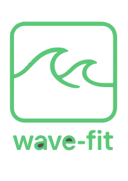

<p align="center">
  
</p>

<h1 align="center">🏋️ WaveFit</h1>

<p align="center">
  <strong>Tu compañero de entrenamiento personal.</strong><br/>
  Organizá tus rutinas, planificá tu semana y llevá el control de tu progreso fitness.
</p>

<p align="center">
  
  
  
  
  
</p>

<p align="center">
  <a href="https://wave-fit.vercel.app/">🌐 Ver Demo en Vivo</a> •
  <a href="https://github.com/PabloKazalukian/wave-fit-api">🔗 Backend API</a>
</p>

---

<!-- ## 📸 Capturas de Pantalla

<!-- Agregá tus screenshots aquí con el formato:

-->

<!-- | Vista                    | Preview                |
| ------------------------ | ---------------------- |
| **Home**                 | _screenshot pendiente_ |
| **Planificador Semanal** | _screenshot pendiente_ |
| **Rutinas**              | _screenshot pendiente_ |
| **Progreso**             | _screenshot pendiente_ | -->

## ✨ Funcionalidades

### Disponibles

- 📋 **Registro de ejercicios** — Creá y gestioná tu biblioteca personal de ejercicios
- 🗓️ **Planificación semanal** — Armá tu rutina día a día con un planificador visual
- 💪 **Gestión de rutinas** — Organizá ejercicios por categoría muscular (pecho, espalda, piernas, etc.)
- 📊 **Seguimiento de progreso** — Llevá un registro de tu avance semana a semana
- 🔐 **Autenticación con Google** — Inicio de sesión rápido y seguro

### Próximamente

- 📈 **Estadísticas avanzadas** — Gráficos de rendimiento, volumen de entrenamiento y más
- 🏆 **Logros y metas** — Sistema de objetivos personalizados

---

## 🛠️ Stack Tecnológico

| Categoría      | Tecnología               |
| -------------- | ------------------------ |
| **Framework**  | Angular 20               |
| **Lenguaje**   | TypeScript 5.8           |
| **Estilos**    | TailwindCSS 3            |
| **API Client** | Apollo Angular (GraphQL) |
| **State**      | RxJS + Services/Facades  |
| **Fechas**     | date-fns                 |
| **PWA**        | Angular Service Worker   |
| **Deploy**     | Vercel                   |

> 🔗 **Backend:** NestJS + GraphQL + MongoDB — [Ver repositorio](https://github.com/PabloKazalukian/wave-fit-api) | [API en producción](https://wave-fit-api.onrender.com/)

---

## 🚀 Instalación

### Pre-requisitos

- Node.js (v18+)
- npm o yarn

### Setup

```bash
# Clonar el repositorio
git clone https://github.com/PabloKazalukian/wave-fit.git
cd wave-fit

# Instalar dependencias
npm install

# Correr en modo desarrollo
npm start
```

La app se levanta en `http://localhost:4200/`

---

## 📂 Estructura del Proyecto

```
src/
├── app/
│   ├── core/           # Guards, interceptors, servicios base
│   ├── pages/          # Páginas de la app (auth, home, routines, tracking)
│   ├── shared/         # Componentes, servicios y utilidades compartidas
│   ├── app.routes.ts   # Configuración de rutas
│   └── app.config.ts   # Configuración de la app (Apollo, SW, etc.)
├── environments/       # Variables de entorno (dev/prod)
└── styles.css          # Estilos globales
```

---

## 📖 Documentación

La documentación técnica de componentes se encuentra en [`/documents`](./documents/):

- [RoutinePlanComponent](./documents/components/RoutinePlanComponent.md) — Jerarquía y flujo de datos del planificador de rutinas

---

## 👤 Autor

**Pablo Kazalukian**

---

<p align="center">
  Hecho con ❤️ y mucha proteína 💪
</p>
