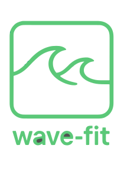

<p align="center">
  
</p>

<h1 align="center">🏋️ WaveFit</h1>

<p align="center">
  <strong>Tu compañero de entrenamiento personal.</strong><br/>
  Organizá tus rutinas, planificá tu semana y llevá el control de tu progreso fitness.
</p>

<p align="center">
  
  
  
  
  
</p>

<p align="center">
  <a href="https://wave-fit.vercel.app/">🌐 Ver Demo en Vivo</a> •
  <a href="https://github.com/PabloKazalukian/wave-fit-api">🔗 Backend API</a>
</p>

---

<!-- ## 📸 Capturas de Pantalla

<!-- Agregá tus screenshots aquí con el formato:

-->

<!-- | Vista                    | Preview                |
| ------------------------ | ---------------------- |
| **Home**                 | _screenshot pendiente_ |
| **Planificador Semanal** | _screenshot pendiente_ |
| **Rutinas**              | _screenshot pendiente_ |
| **Progreso**             | _screenshot pendiente_ | -->

## ✨ Funcionalidades

### Disponibles

- 📋 **Registro de ejercicios** — Creá y gestioná tu biblioteca personal de ejercicios
- 🗓️ **Planificación semanal** — Armá tu rutina día a día con un planificador visual
- 💪 **Gestión de rutinas** — Organizá ejercicios por categoría muscular (pecho, espalda, piernas, etc.)
- 📊 **Seguimiento de progreso** — Llevá un registro de tu avance semana a semana
- 📈 **Estadísticas** — Gráficos de rendimiento y volumen de entrenamiento
- 🏋️ **My Week** — Tu entrenamiento del día con seguimiento de series, pesos y reps
- 🔐 **Autenticación con Google** — Inicio de sesión rápido y seguro

---

## 🛠️ Stack Tecnológico

| Categoría      | Tecnología               |
| -------------- | ------------------------ |
| **Framework**  | Angular 20               |
| **Lenguaje**   | TypeScript 5.8           |
| **Estilos**    | TailwindCSS 3            |
| **API Client** | Apollo Angular (GraphQL) |
| **State**      | RxJS + Services/Facades  |
| **Fechas**     | date-fns                 |
| **PWA**        | Angular Service Worker   |
| **Deploy**     | Vercel                   |

> 🔗 **Backend:** NestJS + GraphQL + MongoDB — [Ver repositorio](https://github.com/PabloKazalukian/wave-fit-api) | [API en producción](https://wave-fit-api.onrender.com/)

---

## 🚀 Instalación

### Pre-requisitos

- Node.js (v18+)
- npm o yarn

### Setup

```bash
# Clonar el repositorio
git clone https://github.com/PabloKazalukian/wave-fit.git
cd wave-fit

# Instalar dependencias
npm install

# Correr en modo desarrollo
npm start
```

La app se levanta en `http://localhost:4200/`

---

## 📂 Estructura del Proyecto

```
src/app/
├── core/                        # Servicios, Auth, Apollo
│   ├── apollo/                  # Queries GraphQL
│   ├── auth/                    # TokenStorage, inicializadores
│   ├── services/                # Todos los servicios
│   │   ├── auth/                # AuthService, CredentialsService
│   │   ├── exercises/           # ExercisesService
│   │   ├── plans/               # PlansService + API + Storage + State
│   │   ├── routines/            # RoutinesService + API
│   │   ├── trackings/           # PlanTrackingService (Domain + API + Storage + State)
│   │   ├── user/                # UserService
│   │   ├── workouts/            # WorkoutStateService
│   │   └── warmup.service.ts
│   └── auth-guard.ts
├── pages/                       # Vistas de la app
│   ├── auth/                    # Login, Register, Callback
│   ├── exercises/               # Biblioteca de ejercicios
│   ├── home/                    # Dashboard
│   ├── my-week/                 # Entrenamiento de la semana
│   ├── plans/                   # Planes y creación
│   ├── routines/                # Gestión de rutinas
│   ├── trackings/               # Seguimiento y estadísticas
│   └── user/                    # Perfil de usuario
├── shared/
│   ├── components/
│   │   ├── layout/              # Header, Footer
│   │   ├── ui/                  # Botones, inputs, dialogs, tablas
│   │   └── widgets/             # Componentes de negocio
│   ├── interfaces/              # Tipos e interfaces
│   ├── pipes/                   # Pipes personalizados
│   ├── utils/                   # Utilidades
│   ├── validators/              # Validadores de formularios
│   └── wrappers/                # Transformadores de datos
├── app.routes.ts                # Rutas de la app
├── app.config.ts                # Configuración (Apollo, PWA, etc.)
└── logo.svg                     # Logo de la app
```

### Rutas de la App

| Ruta               | Descripción              |
| ------------------ | ------------------------ |
| `/auth/login`      | Inicio de sesión         |
| `/auth/register`   | Registro de usuario      |
| `/home`            | Dashboard principal      |
| `/exercises`       | Biblioteca de ejercicios |
| `/routines`        | Gestión de rutinas       |
| `/plans`           | Lista de planes          |
| `/plans/create`    | Crear nuevo plan         |
| `/my-week`         | Entrenamiento del día    |
| `/trackings`       | Lista de seguimientos    |
| `/trackings/:id`   | Detalle de seguimiento   |
| `/trackings/stats` | Estadísticas de progreso |
| `/user`            | Perfil de usuario        |

---

## 📖 Documentación

La documentación técnica de componentes y servicios se encuentra en [`/documents`](./documents/):

### Componentes

| Documento                                                              | Descripción                        |
| ---------------------------------------------------------------------- | ---------------------------------- |
| [RoutinePlanComponent](./documents/components/RoutinePlanComponent.md) | Creación de rutinas semanales      |
| [MyWeekComponent](./documents/components/MyWeekComponent.md)           | Tracking y seguimiento de workouts |

### Servicios

| Documento                                                                  | Descripción                        |
| -------------------------------------------------------------------------- | ---------------------------------- |
| [AuthenticationAndApollo](./documents/services/AuthenticationAndApollo.md) | Auth y configuración Apollo        |
| [ExercisesService](./documents/services/ExercisesService.md)               | Biblioteca de ejercicios           |
| [RoutinesService](./documents/services/RoutinesService.md)                 | Gestión de rutinas                 |
| [UserService](./documents/services/UserService.md)                         | Perfil de usuario                  |
| [WorkoutStateService](./documents/services/WorkoutStateService.md)         | Estado de workouts activos         |
| [Índice de servicios](./documents/services/index.md)                       | Arquitectura completa de servicios |

---

## 👤 Autor

**Pablo Kazalukian**

---
