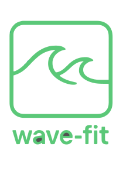

<p align="center">
  
</p>

<h1 align="center">🏋️ WaveFit</h1>

<p align="center">
  <strong>Tu compañero de entrenamiento personal.</strong><br/>
  Organizá tus rutinas, planificá tu semana y llevá el control de tu progreso fitness.
</p>

<p align="center">
  
  
  
  
  
</p>

<p align="center">
  <a href="https://wave-fit.vercel.app/">🌐 Ver Demo en Vivo</a> •
  <a href="https://github.com/PabloKazalukian/wave-fit-api">🔗 Backend API</a>
</p>

---

## ✨ Funcionalidades

- 📋 **Registro de ejercicios** — Creá y gestioná tu biblioteca personal de ejercicios
- 🗓️ **Planificación semanal** — Armá tu plan semana a semana con un planificador visual día por día
- 💪 **Gestión de rutinas** — Organizá ejercicios por categoría muscular (pecho, espalda, piernas, etc.)
- 🏋️ **My Week / My Day** — Seguimiento de entrenamiento con series, pesos y reps; modo semanal o diario
- 📊 **Seguimiento de progreso** — Control del avance semana a semana con estadísticas e historial (calendario)
- 🧠 **Coach AI** — Generá planes de entrenamiento con IA a partir de una descripción
- 🔌 **PWA offline-first** — La app funciona sin conexión: ediciones optimistas + sync al recuperar red
- 🔐 **Autenticación con Google** — Inicio de sesión rápido y seguro

---

## 🛠️ Stack Tecnológico

| Categoría      | Tecnología                       |
| -------------- | -------------------------------- |
| **Framework**  | Angular 20.3                     |
| **Lenguaje**   | TypeScript 5.8                   |
| **Estilos**    | TailwindCSS 3                    |
| **API Client** | Apollo Angular (GraphQL)         |
| **State**      | Signals + RxJS + Facades         |
| **Fechas**     | date-fns + `LocalDate`           |
| **PWA**        | Workbox (service worker)         |
| **Almacén**    | IndexedDB (Dexie) + localStorage |
| **Deploy**     | Vercel                           |

> 🔗 **Backend:** NestJS + GraphQL + MongoDB — [Ver repositorio](https://github.com/PabloKazalukian/wave-fit-api) | [API en producción](https://wave-fit-api.onrender.com/)

---

## 🚀 Instalación

### Pre-requisitos

- Node.js (v18+)
- npm o yarn

### Setup

```bash
# Clonar el repositorio
git clone https://github.com/PabloKazalukian/wave-fit.git
cd wave-fit

# Instalar dependencias
npm install

# Correr en modo desarrollo
npm start
```

La app se levanta en `http://localhost:4200/`

### Scripts útiles

```bash
npm run lint     # ESLint
npm test         # Unit tests (Karma + Jasmine)
npm run build    # Build producción + service worker (Workbox)
```

---

## 🛣️ Rutas de la App

| Ruta                          | Descripción                         |
| ----------------------------- | ----------------------------------- |
| `/auth/*`                     | Login, register, callback (público) |
| `/home`                       | Dashboard principal                 |
| `/coach`                      | Coach IA                            |
| `/exercises`                  | Biblioteca de ejercicios            |
| `/routines/show/:id`          | Detalle de rutina                   |
| `/plans` `/plans/create`      | Planes semanales + planificador     |
| `/my-week` `/my-week/success` | Entrenamiento (modo semana)         |
| `/my-day` `/my-day/success`   | Entrenamiento (modo día)            |
| `/user`                       | Perfil de usuario                   |
| `/user/profile`               | Edición de perfil                   |
| `/user/history`               | Historial / calendario              |
| `/user/trackings`             | Historial de seguimientos           |
| `/user/trackings/:id`         | Detalle de un seguimiento           |
| `/user/trackings/stats`       | Estadísticas de progreso            |
| `/user/tracking/day/:id`      | Detalle de un day-log               |

Todas excepto `/auth` requieren sesión iniciada (`authGuard`).

---

## 📖 Documentación

La documentación técnica vive en [`/docs`](./docs/) (inglés, spec-anclada). Para empezar: [docs/README.md](./docs/README.md).

| Recurso                                           | Descripción                              |
| ------------------------------------------------- | ---------------------------------------- |
| [Specs](./docs/specs/README.md)                   | Contratos por feature (fuente de verdad) |
| [Domain](./docs/domain/README.md)                 | Glosario y business rules                |
| [Engineering](./docs/engineering/README.md)       | Arquitectura, coding standards, tests    |
| [UI Conventions](./docs/design/ui-conventions.md) | Colores, spacing, tipografía, botones    |
| [Archivo histórico](./docs/legacy/README.md)      | Antiguos `documents/` (referencia)       |

---

## 👤 Autor

**Pablo Kazalukian**

---
